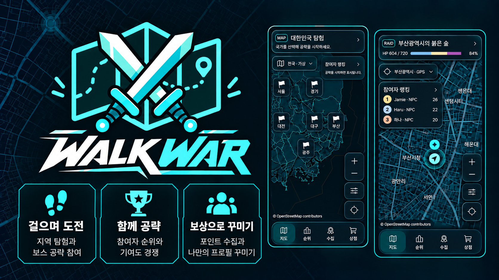

# Walk War

## 소개

'여행'의 목적은 무엇일까요? 여행을 즐기는 사람들의 이유는 제각각입니다.    
새로운 만남과 경험을 목적으로 하는 사람, 일상에서 벗어난 여유와 힐링을 즐기려는 사람.  
여행을 여러 차례 다니다 보면 어느 순간 여행의 목적이 비슷해지고, 일상을 벗어나기 위한 여행이 일상과 다를 바 없는 지루함으로 뒤덮입니다.  
**WalkWar**는, 그런 여행에 한 줄기 즐거움을 더합니다.  
여행지에서 만나는 거대한 몬스터를, 여행을 다니며 걷는 걸음걸이의 힘으로 무찌릅니다.  
매번 같은 곳만 보게 되면 필연적으로 발생하는 매너리즘을, 일상과 다를 바 없는 행동을 통해 깨부수는 경험을 제공합니다.  

**Walk War**는 여행 중의 반복적인 걷기를 협동 레이드 경험으로 바꾸는 걷기 게임입니다.

사용자는 지역의 레이드에 참가하고, 걸음을 쌓아 다른 참가자들과 함께 보스의 HP를 감소시킵니다.
지도 위에서는 주변 참가자와 지역 명소를 확인하고,
레이드 기여도와 개인 순위를 통해 자신의 탐험 기록을 확인할 수 있습니다.

걷고 있는 시간 자체를 하나의 게임 플레이로 만드는 것을 목표로 합니다.

## 핵심 기능

- 👟 **도시를 레이드하다, 걸음으로 점령하는 도시**
  - 걸음 수를 레이드 기여도로 변환합니다.
  - 한 걸음이 1 데미지, 정직하게 걸음으로 승부합니다.

- 🏆 **참가자 랭킹**
  - 상위 참가자의 기여도를 확인할 수 있습니다.
  - 자신의 현재 순위를 함께 확인할 수 있습니다.

- 🎖️ **배지와 수집 요소**
  - 레이드 및 지역 탐험을 통해 기록과 배지를 수집합니다.
  - 레이드 상위권 참가자가 되어 배지를 모아보세요!

- 🛍️ **포인트와 꾸미기 요소**
  - 레이드 참여로 얻은 포인트를 이용해 프로필 프레임, 배지, 이름표 등의 장식 요소를 얻을 수 있습니다.
